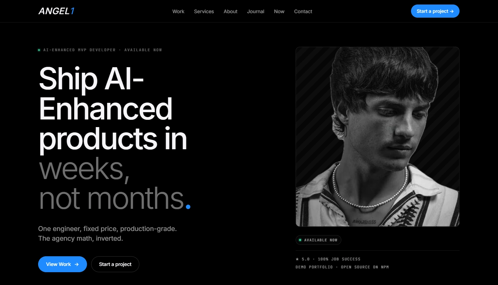

# Angel1

Personal site for Massimiliano Angelone — AI-Enhanced MVP Developer based in Tenerife. Productized engagements, public pricing, work case studies, journal essays. Built as a Next.js + MDX portfolio.

**Live →** [massimilianoangelone.com](https://massimilianoangelone.com)



## What it is

A statically-rendered portfolio site that ships marketing copy, productized pricing, four MDX case studies, a personal essay, and a Resend-powered contact endpoint. Editorial-tech aesthetic — true black, Inter + Newsreader + JetBrains Mono, asymmetric grids — and everything is Lighthouse-greenable on a mid-range laptop.

The site is the lead funnel: visitors land on the home, read the work, read the long-form essay, and reach out via the contact form. Tooling that I use on client engagements ships from here: [Lore](https://github.com/maxange-developer/lore), [Email Triage](https://github.com/maxange-developer/email-triage), [angel1-mvp-toolkit](https://github.com/maxange-developer/angel1-mvp-toolkit), [angel1-rag-eval](https://github.com/maxange-developer/angel1-rag-eval).

## Features

- **Productized work index** — four MDX case studies under `/work/[slug]`, each with hero, stats, body, and CTA footer
- **Long-form journal** — MDX essays under `/journal/[slug]` with editorial typography, figures, and pull quotes
- **Public services page** — three pricing tiers in USD, side-by-side comparison table, FAQ
- **Contact form** — qualifying form with project type / budget / timeline, sent via Resend API
- **Custom error pages** — editorial 404 + 500 consistent with site aesthetic
- **i18n IT/EN/ES** — locale-aware copy across home, services, contact, journal
- **SEO + manifest** — OG/Twitter cards, sitemap, PWA manifest, favicons
- **`/now` page** — current state of work, updated every 1–2 months

## Stack

```
Framework    Next.js 16 (App Router) + React 19 + TypeScript strict
Styling      Tailwind CSS v4 + Newsreader + Inter + JetBrains Mono
Content      MDX with next-mdx-remote (work case studies + journal)
Animation    framer-motion (Reveal component, scroll-aware)
Email        Resend (transactional contact form)
i18n         Custom locale provider (en / it / es)
Tests        Vitest (unit)
Hosting      Vercel (production on main, preview on develop)
```

## Repo structure

```
content/
  work/                Four case study MDX files (lore, email-triage, mvp-toolkit, rag-eval)
  journal/             Long-form essays (the-long-road, ...)
src/
  pages/               Routes (home, services, contact, /work/[slug], /journal/[slug], /now)
  components/          Layout, Footer, Reveal, Figure, page-specific sections
  lib/
    mdx.ts             Frontmatter parsing + slug routing
    resend.ts          Contact form transport
public/
  images/              Site imagery (work covers, journal figures, hero, /about)
  site.webmanifest     PWA manifest
  favicons             Multi-resolution favicon set
docs/                  This README's hero image
```

## Run locally

```bash
git clone https://github.com/maxange-developer/angel1.git
cd angel1
pnpm install
cp .env.example .env.local
# fill in RESEND_API_KEY for contact form (optional for dev)
pnpm dev   # http://localhost:3000
```

`pnpm build` for production build, `pnpm start` to serve the build locally.

## Deployment

The repo is wired to Vercel. `main` is the production branch (serves [massimilianoangelone.com](https://massimilianoangelone.com)), `develop` is the integration branch (auto-deployed to a preview URL). Push to `develop`, validate the preview, merge to `main` for production rollout.

## Scope

This is my personal site. The code is MIT-licensed and the structure is fork-friendly, but the branding, copy, photographs, and case study content are mine — don't republish them as your own. Use the structural patterns (work index, productized pricing, editorial typography) freely.

## License

MIT.

## Author

Built by [Massimiliano Angelone](https://massimilianoangelone.com) — AI-Enhanced MVP Developer, Tenerife.
